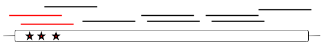
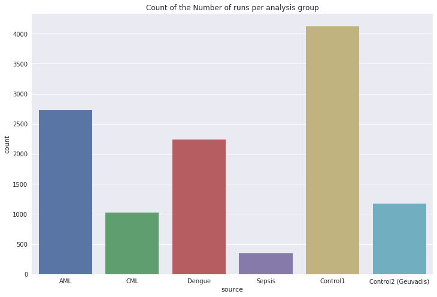
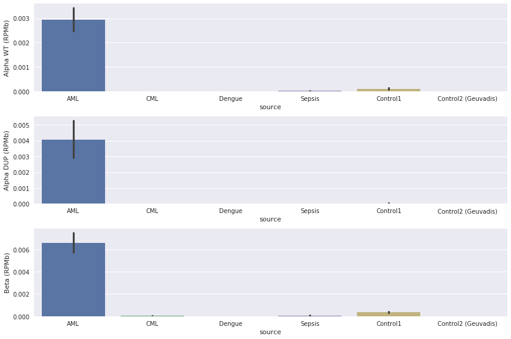
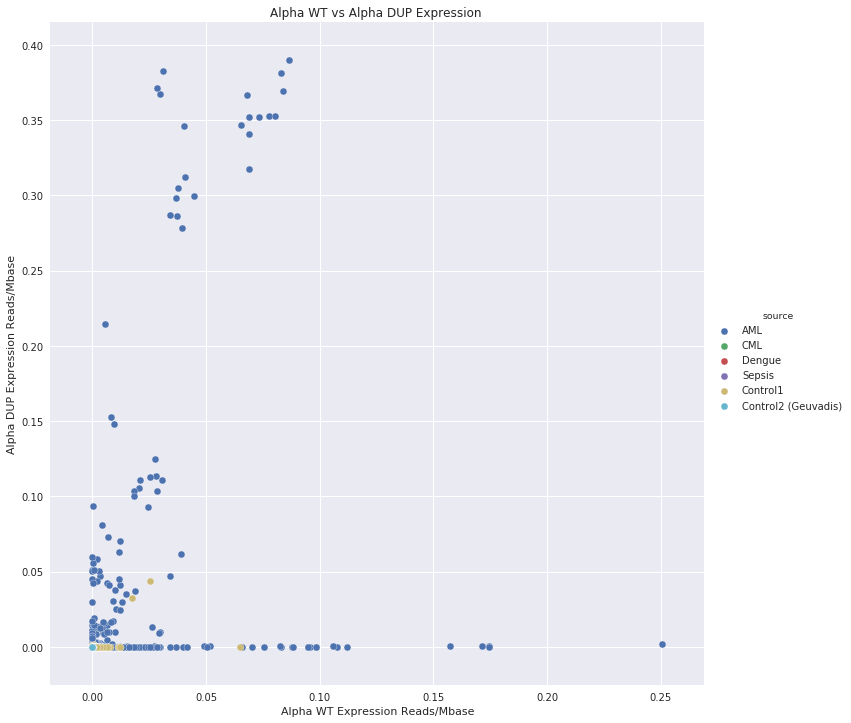
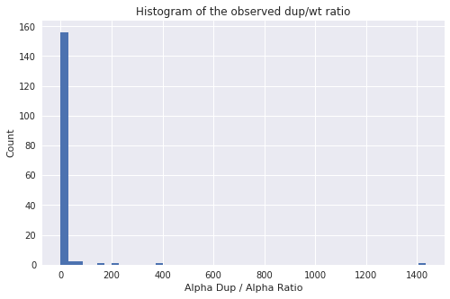
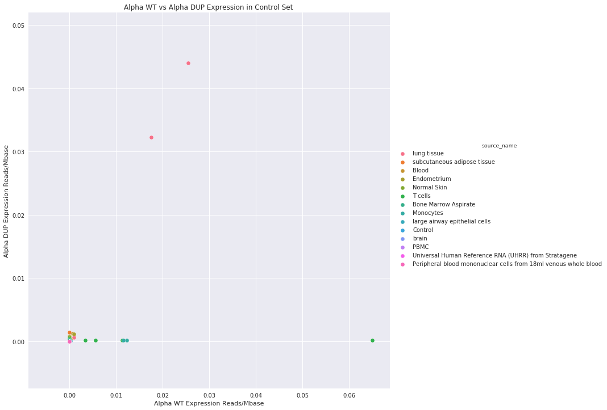

# Finding A Structural Variant at the Tryptase Locus

## About

There are a number of genes within the Tryptase family all of which are closely related. The two main genes within the family are the TPSAB1 and TPSB2 known as alpha and beta respectively.

There is evidence that duplication of the TPSAB1 gene is linked to certain phenotypic  traits. For example susceptibility to infection [1,2,3]

Duplication of the TPSAB1 locus is associated with a number of SNPs at the 5' prime end of the transcript. These SNPs allow the duplicated TPSAB1 and wild-type TPSAB1 to be distinguished from each other.

This project uses these SNPs to look for expression of the wild-type and duplicated TPSAB1 in publicly available RNA Seq data from the Sequence Read Archive (SRA).

## Methods

Detecting gene duplications would not normally be possible from RNA Sequencing data. The SNPs associated with the duplication make this possible.

Figure 1 below shows the strategy. Only reads which cross the region of the transcript with the SNPs are counted.




## Requirements

### Applications

* magicblast
* samtools
* python3


### Python Libraries

* pysam
* matplotlib
* seaborn
* pandas

### Misc

* Note that running this code assumes you have access to a Sun Grid Engine computing cluster. If this is not the case you can edit the create_jobs.sh script to run the code on a normal server.

## Running the Code

### Collect code

```
git clone https://github.com/NCBI-Hackathons/Tryptase_Duplication.git

```

```
cd Tryptase_Duplication

```


### Data Generation

#### Create MagicBlast database

For detailed instructions see: https://ncbi.github.io/magicblast/cook/blastdb.html

```
makeblastdb -in reference_sequences/aab_spliced.fasta -dbtype nucl -parse_seqids -out blast_dbs/aab_spliced

```
#### Download accession list and RunTable

Use the run selector on the SRA: https://www.ncbi.nlm.nih.gov/sra

Alternatively see the accession_lists/ directory e.g accession_lists/Public_AML_RNA_Acc_List.txt for the AML list.   

Ensure you also download the run table information as this will allow meta data analysis.

#### Create jobs for submission

This create a series of jobs ready for submission to the Grid Engine computing cluster. Example below. See comments in the create_jobs.sh script for help.

 ```
 bash create_jobs.sh accession_lists/Public_AML_RNA_Acc_List.txt aabspliced 1 results jobs grid_job_template.txt

 ```

#### Submit jobs

Use the submit_jobs.sh script to submits jobs to the Grid Engine computing cluster.

```
bash submit_jobs.sh $JOB_FOLDER

```
Where $JOB_FOLDER is the directory containing the jobs created in the previous step.

## Data Analysis

### Process SAM files

Pysam requires the SAMs to be converted into BAMs for some steps. So run the following:

```
bash process_sams.sh $RESULTS_DIR

```
Where $RESULTS_DIR is the directory containing the results from the alignments i.e the SAM files created by magicblast

### Count Hits

First we count the hits using the run_pipeline.py script. This script will also query the Entrez API to get the spot count of each run in order to normalise the data. This process can take a while.

This program outputs a CSV file for downstream analysis.

Alternatively you can skip normalisation at this step and normalise by the base count in the meta data run table information you downloaded earlier.

Example shown below:

```
python run_pipeline.py --bam_folder ../results/geuvadis_results --source geu --roi_start 25 --roi_end 45 --email halsteadjs@nih.gov --max_errors 3 --file_comment geu
```

### Merge with Meta Data

Open the analysis/notebooks/merge_with_meta.ipynb notebook

Edit the options at the top of the notebook.
df_meta = location of the run info table tsv
df_data = location of the csv outputted by run_pipeline.py
output_name = name of output csv
normalise_with_mbases = True if you want to normalise with the mbases attribute

### Create Figures

There are a number of notebooks available to creating figures:

* create_scatter_figure.ipynb
* analysis_for_final_meeting.ipynb

The location of the result CSV(s) can be updated at the top of the notebooks.

## Results

### Comparison of AML, Dengue, Sepsis, CML and control groups.

Here is a comparison of various datasets. Accession lists were gathered from SRA for the following datasets:

* AML
* CML
* Sepsis
* Dengue Fever
* Geuvadis Controls
* Healthy Controls (Multiple Tissues)

Figure 2 shows the number of runs that we had for each data set.


Figure 2: The number of datasets in each group

Figure 3 shows the expression in each of these datasets.


Figure 3: The normalised number of reads crossing the SNP locus.

Figure 4 shows the relative normalised read counts in for Alpha Wt and Alpha DUP.



### TPSAB1 Dup / TPSAB1 WT Ratio

We also looked at the Alpha DUP / Alpha WT ratio in each SRA run. Interesting the top two runs/samples were in the same BioProject (PRJNA386992). This was a study looking at dmins in AML [4].

* SAMN07139337
* SAMN07139333

Figure 5 shows a hisogram of the Alpha DUP / Alpha WT ratios


Figure 5: For most runs the ratio is very low although there are some interesting outliers.

### Misc


Figure 6: Breakdown of the runs by tissue type

## Further Work

* Look at TCGA data

## References

[1] https://www.nature.com/articles/gim2017136

[2] https://www.nature.com/articles/ng.3696

[3] https://www.nih.gov/news-events/news-releases/nih-scientists-uncover-genetic-explanation-frustrating-syndrome

[4] https://www.ncbi.nlm.nih.gov/pubmed/29180669
